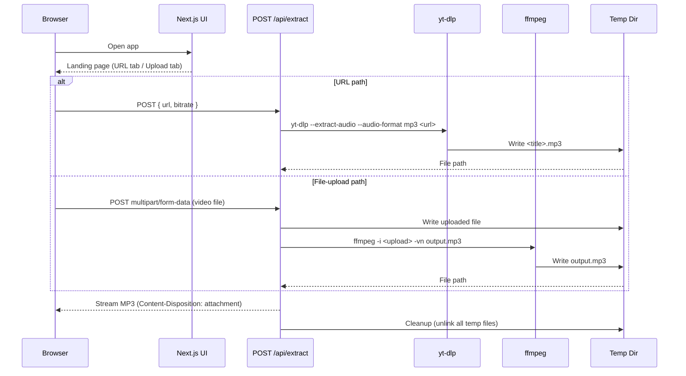

# AudioGrab — System Architecture

## Overview

AudioGrab is a single Next.js application (App Router) that presents a browser-based UI and exposes one API route — `POST /api/extract` — which orchestrates audio extraction via `yt-dlp` (for URLs) and `ffmpeg` (for direct file uploads). The app is deployed on a container-friendly host (Railway, Render, or Fly.io) so that native binaries can run without the time and size constraints of serverless functions. All intermediate files live in a server-side temp directory and are deleted immediately after the response is delivered — no persistent storage is used.

---

## Request Flow



---

## Data Flow — Two Paths

### Path A: URL Extraction

1. The browser POSTs `{ url: "<video-url>", bitrate: 192 }` as JSON.
2. `/api/extract` validates the URL (must be a parseable `http/https` address).
3. A child process runs `yt-dlp --extract-audio --audio-format mp3 --audio-quality <bitrate>k -o "<tmpdir>/%(title)s.%(ext)s" <url>`.
4. `yt-dlp` handles authentication, format selection, and muxing internally — it writes a ready `.mp3` to the temp directory.
5. The video title is parsed from `yt-dlp --print title <url>` (or extracted from the output filename) to use in `Content-Disposition`.
6. The route streams the file back and then deletes it.

### Path B: File Upload

1. The browser POSTs `multipart/form-data` containing the video file (field name `file`) and optional `bitrate`.
2. `/api/extract` enforces the 200 MB cap on incoming `Content-Length` before writing to disk.
3. The uploaded file is saved to a temp path with a random UUID filename.
4. A child process runs `ffmpeg -i <input-path> -vn -ar 44100 -ac 2 -b:a <bitrate>k <output-path>.mp3`.
5. The output `.mp3` is streamed back; both temp files (input and output) are deleted in `finally`.

---

## Component Breakdown

### Frontend

| Component | Responsibility |
|---|---|
| `app/page.tsx` | Root page — renders the extraction card |
| `components/UrlInput.tsx` | Controlled text input for video URLs with basic validation |
| `components/FileDropzone.tsx` | Drag-and-drop zone using the File API; enforces 200 MB cap client-side |
| `components/BitrateSelector.tsx` | 128 / 192 / 320 kbps radio group |
| `components/ExtractButton.tsx` | Triggers the API call; manages loading state |
| `components/StatusBanner.tsx` | Displays loading spinner, success download link, or error message |

### Backend

| Module | Responsibility |
|---|---|
| `app/api/extract/route.ts` | Next.js route handler; parses request, delegates to extraction layer, streams response |
| `lib/extract/fromUrl.ts` | Spawns `yt-dlp`; returns `{ filePath, title }` or throws `ExtractionError` |
| `lib/extract/fromFile.ts` | Spawns `ffmpeg`; returns `{ filePath }` or throws `ExtractionError` |
| `lib/extract/cleanup.ts` | `unlinkSafe(paths[])` — silently swallows ENOENT, logs other errors |
| `lib/errors.ts` | Typed `ExtractionError` class with `code` enum used across the extraction layer |

---

## Temp-File Lifecycle

```
Request arrives
      │
      ▼
Write to /tmp/<uuid>/ ──────────────────────────────┐
      │                                              │
      ▼                                         (on error)
Run yt-dlp / ffmpeg                                  │
      │                                              │
      ▼                                              ▼
Stream .mp3 to client ◄──────────────── ExtractionError thrown
      │
      ▼
finally { unlinkSafe(tempFiles) }   ◄── runs in ALL cases
```

**Key guarantee:** temp files are cleaned up inside a `try/finally` block in the route handler, meaning cleanup runs whether extraction succeeds, fails, or the client disconnects mid-stream. Files are never held longer than a single request lifecycle.

---

## Deployment Topology

```
┌─────────────────────────────────────────────────┐
│                   Railway / Render / Fly.io      │
│                                                 │
│  ┌───────────────────────────────────────────┐  │
│  │           Next.js (App Router)            │  │
│  │                                           │  │
│  │  GET  /          → Landing page (SSR)     │  │
│  │  POST /api/extract → Extraction handler   │  │
│  │                                           │  │
│  │  System binaries:  yt-dlp, ffmpeg         │  │
│  │  Temp storage:     /tmp  (ephemeral)      │  │
│  └───────────────────────────────────────────┘  │
└─────────────────────────────────────────────────┘
         ▲
         │  HTTPS
         │
┌────────┴────────┐
│    Browser      │
│  (any device)   │
└─────────────────┘
```

### Why Not Vercel Serverless for the Backend?

Vercel serverless functions impose hard limits that make audio extraction impractical:

| Constraint | Vercel Limit | AudioGrab Reality |
|---|---|---|
| Execution timeout | 60 s (Pro), 10 s (Hobby) | A 10-min video can take 60–120 s |
| Response body size | 4.5 MB streaming cap | MP3s routinely exceed 10–50 MB |
| Filesystem | Read-only (except `/tmp`, 512 MB) | Need to write, process, and read back files |
| Native binaries | Not bundleable at deployment size | `ffmpeg` static build is ~80 MB; `yt-dlp` is a Python app |
| Cold-start memory | 1 024 MB max | `ffmpeg` transcoding can spike well above this |

Railway, Render, and Fly.io run a persistent container process with no timeout ceiling on individual requests, full filesystem write access, and the ability to install `yt-dlp` and `ffmpeg` as system packages in a `Dockerfile`. This makes them the appropriate deployment target for any workload that shells out to native media tools.
